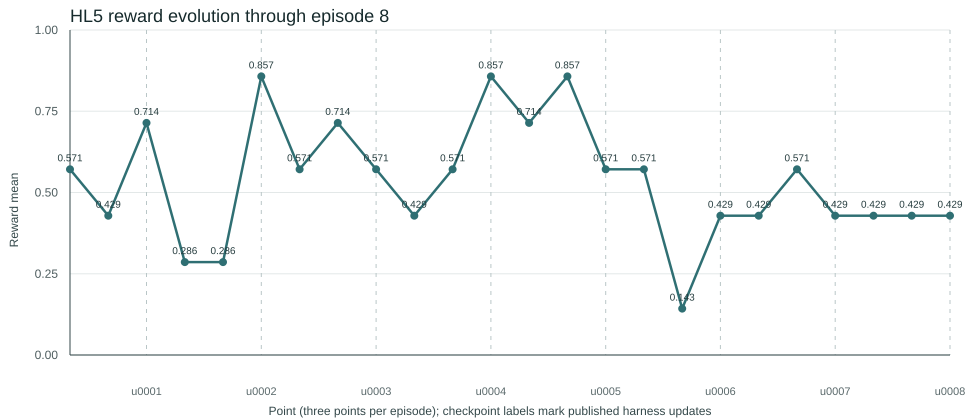

# HL5 eight-episode reward and harness-update analysis

## Scope

This standalone report reconstructs all eight HL5 episodes directly from the recorded sequence artifacts. It does not depend on the six- or seven-episode reports.

An episode is three valid `full_orchestration` `sample_result.json` records under one active harness. Each record scores seven suffix tasks, so each episode contains 21 scored tasks. Episode 8 is the completed `update_0007` evaluation sequence at `data/sequences/sequence-20260718-211136-1021275815`; it resolved `promoted:HL5@update_0007` with overlay digest `sha256:a03ee429214d54a79cb61415c3d90af5ee5fafe969043faa8eb80847af7ef659`.

Episode 7 is reconstructed from one valid pre-interruption iteration plus two makeup iterations. The failed local-Docker infrastructure iteration is excluded because it did not produce a valid scored sample result. Episode 8 contains three valid iterations and no infrastructure failures.

## Basic statistics

| Episode | Harness used | Three iteration rewards | Successes | Episode mean | Change from prior episode | Checkpoint after episode |
|---|---|---:|---:|---:|---:|---|
| 1 | baseline | `0.571`, `0.429`, `0.714` | 12/21 | **0.571429** | - | `update_0001` |
| 2 | update_0001 | `0.286`, `0.286`, `0.857` | 10/21 | **0.476190** | -0.095238 | `update_0002` |
| 3 | update_0002 | `0.571`, `0.714`, `0.571` | 13/21 | **0.619048** | 0.142857 | `update_0003` |
| 4 | update_0003 | `0.429`, `0.571`, `0.857` | 13/21 | **0.619048** | 0.000000 | `update_0004` |
| 5 | update_0004 | `0.714`, `0.857`, `0.571` | 15/21 | **0.714286** | 0.095238 | `update_0005` |
| 6 | update_0005 | `0.571`, `0.143`, `0.429` | 8/21 | **0.380952** | -0.333333 | `update_0006` |
| 7 | update_0006 | `0.429`, `0.571`, `0.429` | 10/21 | **0.476190** | 0.095238 | `update_0007` |
| 8 | update_0007 | `0.429`, `0.429`, `0.429` | 9/21 | **0.428571** | -0.047619 | `update_0008` |

Across all eight episodes, reward is **90/168 = 0.535714**. Episode 5 remains best at `.714286`; episode 6 remains worst at `.380952`. Episode 8 scored **9/21 = .428571**, down one task from episode 7's **10/21 = .476190**.

## Reward plot

The machine-readable point-level data is in [`eight_episode_reward_stats.csv`](eight_episode_reward_stats.csv).

## Source reconstruction

| Points | Episode | Source sequence and iteration |
|---:|---:|---|
| 1-3 | 1 | `sequence-20260714-221157-42`, `iter-1` through `iter-3` |
| 4-6 | 2 | `sequence-20260715-191411-2118514157`, `iter-1` through `iter-3` |
| 7 | 3 | `sequence-20260715-213005-3732207999/iter-1` |
| 8-9 | 3 | `sequence-20260715-225048-3732208000/iter-1` and `iter-2` |
| 10-11 | 4 | `sequence-20260716-104906-2014387070/iter-1` and `iter-2` |
| 12 | 4 | `sequence-20260716-131438-2014387072/iter-1` |
| 13-15 | 5 | `sequence-20260716-142426-3147520901`, `iter-1` through `iter-3` |
| 16-18 | 6 | `sequence-20260716-164851-2865147724`, `iter-1` through `iter-3` |
| 19 | 7 | `sequence-20260718-153029-1258042773/iter-1` |
| 20-21 | 7 | `sequence-20260718-170347-1258042774/iter-1` and `iter-2` |
| 22-24 | 8 | `sequence-20260718-211136-1021275815`, `iter-1` through `iter-3` |

## Episode 8 update_0007 outcome

| Family | Successes | Scored tasks | Success rate |
|---|---:|---:|---:|
| HWPX-Document-Automation | 5 | 5 | 1.000 |
| Healthcare-Cost-Benefit-Analysis | 2 | 6 | 0.333 |
| Inventory-&-Finance-Integration | 2 | 6 | 0.333 |
| Weighted-Risk-Assessment | 0 | 4 | 0.000 |

Scored task outcomes in episode 8:

- Iteration 1: `HWPX-Document-Automation/hwpx-training-feedback` -> success (`1.0`).
- Iteration 1: `Inventory-&-Finance-Integration/new_task_9_datacenter_capacity_rollforward` -> failure (`0.0`).
- Iteration 1: `Healthcare-Cost-Benefit-Analysis/harbor_cyclemargin_30v90` -> failure (`0.0`).
- Iteration 1: `HWPX-Document-Automation/hwpx-supplier-contact-sheet` -> success (`1.0`).
- Iteration 1: `Inventory-&-Finance-Integration/new_task_11_media_rights_rollforward` -> failure (`0.0`).
- Iteration 1: `Inventory-&-Finance-Integration/new_task_11_datacenter_stochastic_refills` -> success (`1.0`).
- Iteration 1: `Inventory-&-Finance-Integration/new_task_10_maintenance_calcfields_restock` -> failure (`0.0`).
- Iteration 2: `Healthcare-Cost-Benefit-Analysis/harbor_syncpack_28v56` -> failure (`0.0`).
- Iteration 2: `Weighted-Risk-Assessment/hospital-capacity-at-risk-calc` -> failure (`0.0`).
- Iteration 2: `HWPX-Document-Automation/hwpx-renewal-playbook-update` -> success (`1.0`).
- Iteration 2: `Healthcare-Cost-Benefit-Analysis/harbor_diagpanel_14v28` -> success (`1.0`).
- Iteration 2: `Weighted-Risk-Assessment/weighted-hospital-bedflow-calc` -> failure (`0.0`).
- Iteration 2: `Inventory-&-Finance-Integration/harbor_gdpval_21` -> failure (`0.0`).
- Iteration 2: `Healthcare-Cost-Benefit-Analysis/harbor_gdpval_42` -> success (`1.0`).
- Iteration 3: `Weighted-Risk-Assessment/campus-budget-at-risk-calc` -> failure (`0.0`).
- Iteration 3: `HWPX-Document-Automation/hwpx-project-proposal` -> success (`1.0`).
- Iteration 3: `Weighted-Risk-Assessment/weighted-campus-energy-balance-calc` -> failure (`0.0`).
- Iteration 3: `Inventory-&-Finance-Integration/new_task_9_hospital_staffing_resilience` -> success (`1.0`).
- Iteration 3: `Healthcare-Cost-Benefit-Analysis/harbor_vaxcrate_6v12` -> failure (`0.0`).
- Iteration 3: `HWPX-Document-Automation/hwpx-event-announcement` -> success (`1.0`).
- Iteration 3: `Healthcare-Cost-Benefit-Analysis/harbor_reagentkit_bulk` -> failure (`0.0`).

## Recent-two-episode harness evidence

Only episodes 7 and 8 were used for the update_0008 decision, with all other factors unchanged.

| Evidence window | Harness evaluated | Episode reward | Actual subscriptions | Empty-context tasks |
|---|---|---:|---:|---:|
| Episode 7 | `update_0006` | 10/21 | 45 total, 20 same-category, 25 cross-category | 2/21 |
| Episode 8 | `update_0007` | 9/21 | 15 total, 15 same-category, 0 cross-category | 14/21 |

Interpretation: `update_0007` eliminated delivered cross-category artifacts, but it over-corrected. Fourteen of twenty-one tasks received no materialized context, including several spreadsheet/workbook tasks where episode 7 showed useful same-output-format transfer across Inventory and WRA-like workbook categories. HWPX remained strong (`5/5`) and should stay isolated from non-document artifacts. Healthcare financial-analysis tasks performed best when same financial-analysis context was available and should not receive workbook/workforce/media artifacts.

## update_0008 response

Decision: **TARGETED_UPDATE**.

Change: relax the `update_0007` exact-category materializer guard into an output-contract guard. The new policy allows transfer among spreadsheet/workbook categories (`spreadsheet-formula-reuse`, `cloud-finops`, `media-operations`, `manufacturing-maintenance`, `infrastructure-planning`, `supply-chain`, `fresh-food-operations`, `transit-operations`, and `workforce-planning`) while continuing to isolate `financial-analysis` JSON/Markdown tasks and `document-editing` HWPX/package tasks.

Rationale: this keeps the anti-contamination intent of `update_0007` but avoids starving workbook tasks when the exact benchmark category label differs despite the verifier-facing contract being the same.

## Provenance status

After publishing update_0008, `promoted:HL5` points to `update_0008` with digest `sha256:c65062be2badeb052969ea0c8a0e6f8903d5e3e949b4903b7ce3d2c563e2bed4`. The update_0008 overlay stages only `src/mediated_coevo/diffusion/policy_agent.py`, and its source sequence is `data/sequences/sequence-20260718-211136-1021275815`.
